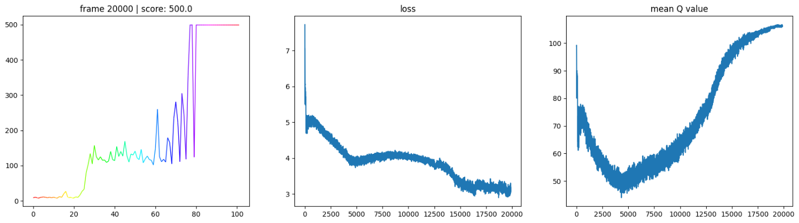

This is my implementation of ["Rainbow is all you need"](https://github.com/Curt-Park/rainbow-is-all-you-need/).

> Performance of Rainbow (from `src/08.ipynb`)

## Index
- 01: Vanilla DQN
- 02: Double DQN
- 03: Prioritized Experience Replay
- 04: Dueling Network
- 05: Noisy Network
- 06: Categorical DQN
- 07: N-step Learning
- 08: Rainbow DQN (combination of all improvements)

## Running
- `pip install` from `requirements.txt`
- Run the notebooks.

## TODO
- 04: add visualization graphs for Advantage (max, min, mean) and Value
    - maybe with a fill between?